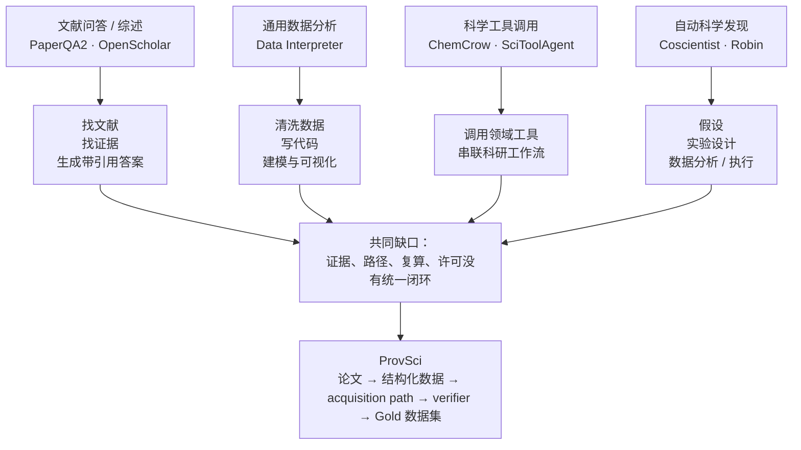

# ProvSci：科学数据智能体现状与功能设计

> 版本：v0.1
> 日期：2026-08-17
> 用途：项目组讨论、向导师/实习老板汇报、后续原型开发依据

## 1. 先说结论

这个方向值得做，但切口不能写成“做一个万能 AI 科学家”。目前最容易做出成果、也最容易形成论文主线的切口是：

> **做一个能从科学论文中生产“可验证数据”的智能体。**

它不是只回答“答案是什么”，而是同时交付四样东西：

1. 答案；
2. 证据在哪里（哪一页、哪张表、哪条曲线）；
3. 答案是怎么从证据变出来的（获取路径）；
4. 这条路径能不能由程序重新跑通（验证结果）。

一句大白话：**别人做的是“帮我读论文/帮我分析数据”，我们要做的是“把论文里的数据加工成以后可以放心拿来训练模型的样本”。**

## 2. 现在这个领域已经做到哪一步了

### 2.1 文献检索和综述：已经比较成熟

PaperQA/PaperQA2、OpenScholar 这类系统已经能从大量论文中检索证据、生成带引用的综述或回答。PaperQA2 重点解决“回答要有依据”，OpenScholar 则把开放论文库、检索、重排和自反馈组合起来。

它们的强项是：找文献、找段落、总结、回答问题。

它们不是我们最好的切口，因为“文献问答”已经有比较成熟的基线，而且答案是否正确仍然主要靠人工或语言模型评价。

### 2.2 通用数据分析：已经能自动写代码，但稳定性不够

Data Interpreter 代表的是另一条路线：用户给数据和任务，智能体自己拆解问题、生成代码、运行代码、根据中间结果继续修改，最后给出图表或模型结果。

它的强项是：数据清洗、探索性分析、建模、可视化和多轮调试。

问题是：它通常关注“最后的分析结果能不能出来”，不一定留下科学论文级别的证据定位、数据许可和完整复算路径。

### 2.3 科学工具调用：可以串工具，但还不等于可靠数据生产

ChemCrow、SciToolAgent、Coscientist 等系统展示了让大模型调用化学、生物、材料和实验室工具的可行性。它们说明“模型 + 工具 + 工作流”确实能完成复杂科研任务，甚至能连接实验设备。

但这类系统普遍依赖人工设计的工具、特定实验环境或领域知识，离“从海量论文稳定生产可训练数据”还有距离。

### 2.4 科学发现智能体：展示很强，但评测仍然暴露短板

ScienceAgentBench 从 44 篇论文中整理了 102 个真实科学数据分析任务，要求智能体输出可以执行的 Python 程序。该基准中最好的设置独立完成率只有约三成，说明“能写出一段看起来合理的代码”与“能可靠完成科学数据分析”之间还有明显差距。

这对我们很重要：**论文不能只展示一个漂亮 demo，必须设计可复算评测。**

### 2.5 当前共同缺口

已有系统大致集中在以下四件事：

| 已有能力 | 仍然缺的东西 |
|---|---|
| 检索论文并回答 | 细粒度证据定位和结构化数据卡 |
| 自动写数据分析代码 | 科学语义、单位、条件和许可管理 |
| 调用大量科学工具 | 每一步能否复现、失败在哪里 |
| 生成假设和实验方案 | 可公开评测、可审计的数据生产链 |

2025 年的数据科学智能体综述也指出，现有系统大多集中在探索分析、可视化和建模，对部署、监控、治理和信任机制覆盖不足；超过 90% 的系统没有明确的信任与安全机制。这个缺口正好可以变成 ProvSci 的研究问题。

### 2.6 综述图：现有系统和我们的切口



图的核心不是说现有工作“不行”，而是把它们的能力拼图和空白位置画出来：ProvSci 站在“科学数据生产和验真”这一层，而不是再做一个普通聊天入口。

## 3. 我们的定位

### 3.1 不做什么

- 不先做“万能科学家”；
- 不先做全学科、百万条数据；
- 不把 LLM 自己说“我答对了”当作验证；
- 不把没有来源的合成题当作主训练数据；
- 不在第一阶段同时做文献、图像、实验机器人和基础模型。

### 3.2 第一阶段做什么

选择一个**数值和表格比较多、结果容易复算**的垂直域，先跑通：

```text
论文 PDF/HTML
    ↓
文档解析：文字、表格、公式、页码、图
    ↓
候选事实发现：数值、比较关系、条件、结果
    ↓
任务改写：问答/查表/计算/关系判断
    ↓
获取路径：从哪一格、做什么转换、如何计算
    ↓
Verifier：按路径重新执行并检查结果
    ↓
Gold 数据卡：答案 + 证据 + 路径 + 许可 + 日志
```

### 3.3 推荐的首个垂直域

如果团队已有生物医学文献和实验语境，优先做：

> **生物医学剂量—效应/浓度数据的可数值子集**，例如 IC50、EC50、fold-change、浓度、时间点和组间差异。

原因是：数据来源多、和现有 BioClaw/生物医学资产能接上，而且单位归一化、算术复算、表格证据定位都能形成明确规则。

如果拿不到稳定的生物医学数据，则退到物理实验表格。判断标准只有一个：**两周内能不能做出一批人工核验的金牌样本。**

## 4. 第一版必须有的功能

### P0：没有这些就不能称为 ProvSci

| 功能 | 输入 | 输出 | 论文价值 |
|---|---|---|---|
| 文档导入 | PDF/HTML/补充材料 | 带页码和 hash 的规范化文档包 | 解决来源追踪 |
| 表格/文本抽取 | 页面、表格、文本块 | 数值、单位、行列位置 | 解决结构化取数 |
| 候选事实发现 | 文档包 | 可转成任务的 claim | 提高数据生产效率 |
| 任务改写 | claim + 证据 | 问题、答案、条件 | 形成训练样本 |
| 路径生成 | 证据和答案 | 白名单动作序列 | 项目的核心差异 |
| 路径验证 | 动作序列 | pass/fail、重算值、误差 | 把“看起来对”变成“跑出来对” |
| 数据质量闸门 | 验证结果 + 许可 | gold/silver/raw 分层 | 控制污染和幻觉 |
| 数据卡展示 | 单条样本 | 答案、证据、路径、日志 | 可做 demo 和人工审阅 |

第一版路径动作只允许少数确定性工具：

```text
read_text_span
extract_table_cell
parse_number_unit
unit_convert
arith_eval
sympy_eval
lookup_condition
```

先把动作做少、做稳。大模型不能用“凭知识回答”“根据经验判断”这种不可执行步骤混过去。

### P1：有了 P0 再加

- 图中数据点读取；
- 补充材料 zip 自动解析；
- 人工复核队列；
- 近重复样本检测；
- 文献级 train/dev/test 隔离；
- 失败原因统计和看板；
- 许可和再分发规则检查。

### P2：暂时不要提前承诺

- 全学科自动综述；
- 全自动实验设计；
- 机器人湿实验闭环；
- 14B/几十 B 级科学基础模型；
- 先做大规模继续预训练。

## 5. 最小可行原型（MVP）

### 输入

20 篇同一垂直域的开放论文，优先选择表格结构清楚、许可明确的论文。

### 输出

至少 100 条人工抽检样本，每条都包含：

- 题目和标准答案；
- 文献 DOI、页码、表号/行列；
- 结构化获取路径；
- 程序重算结果；
- 单位和容差；
- 许可信息；
- 失败或人工修改记录。

### 对照组

至少保留两个对照：

1. 直接让 LLM 从论文生成问答；
2. 让 LLM 生成问答，但不强制路径验证；
3. ProvSci：答案 + 证据 + 路径 + verifier。

这样论文的主问题就很清楚：**加上 provenance 和 verifier 后，数据正确率、证据准确率和复现率是否显著提高。**

## 6. 评测指标

| 指标 | 说人话 | 第一阶段目标 |
|---|---|---:|
| Path Reproducibility | 按路径重跑，能否得到同一个答案 | ≥85%（进入 Gold 前必须 pass） |
| Evidence Precision | 人看证据，是否真的支持答案 | ≥90% |
| Fabrication Rate | 没证据或证据不支持却入库的比例 | ≤2% |
| Unit Accuracy | 单位是否识别和换算正确 | ≥95%（数值子集） |
| Document Leakage | 同一篇论文是否混进不同 split | 0 |
| Cost per Gold | 产出一条金牌样本的模型/人工成本 | 持续下降 |

模型侧再评估：

- 最终答案准确率；
- 模型输出路径的可复现率；
- 证据不足时的拒答率；
- 单位错误和条件遗漏率；
- 文献级 held-out 测试表现。

## 7. 论文主线怎么写

### 研究问题

> 在科学文献数据生产中，显式监督证据和可执行获取路径，是否比只监督最终答案更能提高数据可靠性和模型科学推理能力？

### 方法贡献

1. 提出 provenance-native scientific data agent；
2. 设计白名单 acquisition path 表示；
3. 设计 path verifier 和 Gold 数据闸门；
4. 在一个垂直科学领域建立文献级隔离数据集；
5. 对比 answer-only、path-SFT 和 verifier-guided 方法。

### 结果主表

```text
Base / Instruct
Answer-only SFT
Answer-only RL
Path-aware SFT
Path-aware SFT + Verifier RL
```

主结果不要只报答案准确率，要同时报：

```text
Answer Accuracy + Evidence Precision + Path Reproducibility + Abstention Quality
```

## 8. 接下来两周的具体安排

### 第 1 周：先把规则定死

- 定首个垂直域；
- 冻结 JSON Schema；
- 写 20 条白名单工具的输入输出规范；
- 人工制作 100 条 Gold 样本；
- 确定 3 个失败类型：OCR/表格错、单位歧义、条件缺失；
- 画出一张系统总图和一张数据卡示例图。

### 第 2 周：做最小闭环

- 跑通 PDF → 表格/文本抽取；
- 生成候选 claim；
- 生成 path；
- verifier 能重跑算术和单位转换；
- 产出第一批 20–50 条自动样本；
- 和 answer-only baseline 做一次对照；
- 统计失败，不急着扩数据量。

### 第 3–4 周：扩大并准备汇报

- 20–200 篇文献扩展；
- 加人工复核队列；
- 形成可点击数据卡 demo；
- 做一次文献级 held-out 测试；
- 输出技术报告/论文 proposal。

## 9. 给老板汇报时的一句话定位

> 现在市面上的科研智能体大多是在“帮人读论文”或“帮人跑分析”，我们想补的是中间的数据生产环节：让智能体从论文中抽出带证据、带获取路径、还能被程序复算的科学样本，先在一个垂直领域跑通，再用这些高质量数据训练科学推理模型。

## 10. 参考工作

- Data Interpreter: An LLM Agent For Data Science：<https://arxiv.org/abs/2402.18679>
- PaperQA2 / Language agents achieve superhuman synthesis of scientific knowledge：<https://arxiv.org/abs/2409.13740>
- OpenScholar：<https://www.nature.com/articles/s41586-025-10072-4>
- ScienceAgentBench：<https://arxiv.org/abs/2410.05080>
- SciToolAgent：<https://www.nature.com/articles/s43588-025-00849-y>
- ChemCrow：<https://www.nature.com/articles/s42256-024-00832-8>
- Coscientist：<https://www.nature.com/articles/s41586-023-06792-0>
- LLM-Based Data Science Agents Survey：<https://arxiv.org/abs/2510.04023>
- Robin / A multi-agent system for automating scientific discovery：<https://doi.org/10.1038/s41586-026-10652-y>
