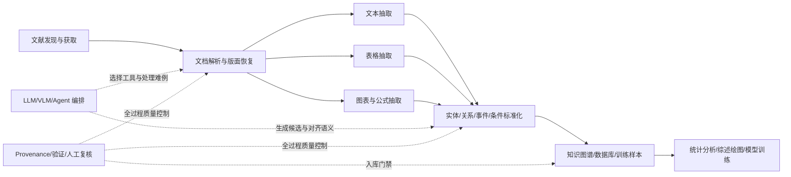
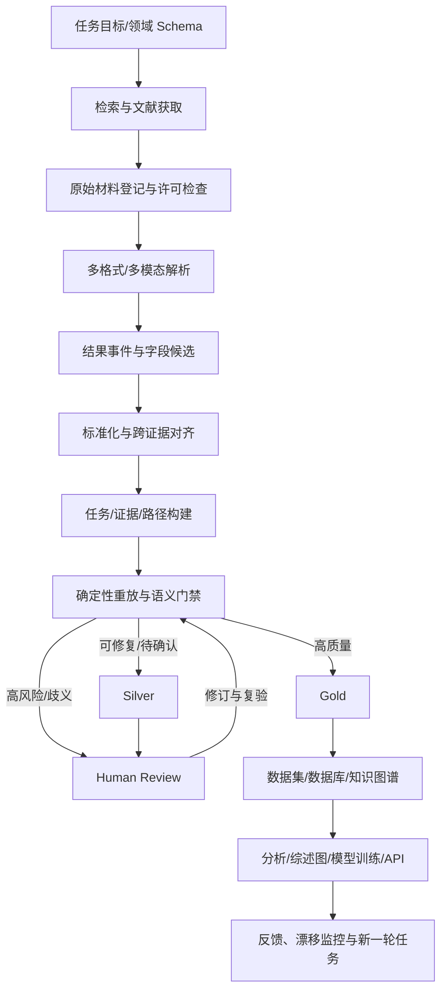
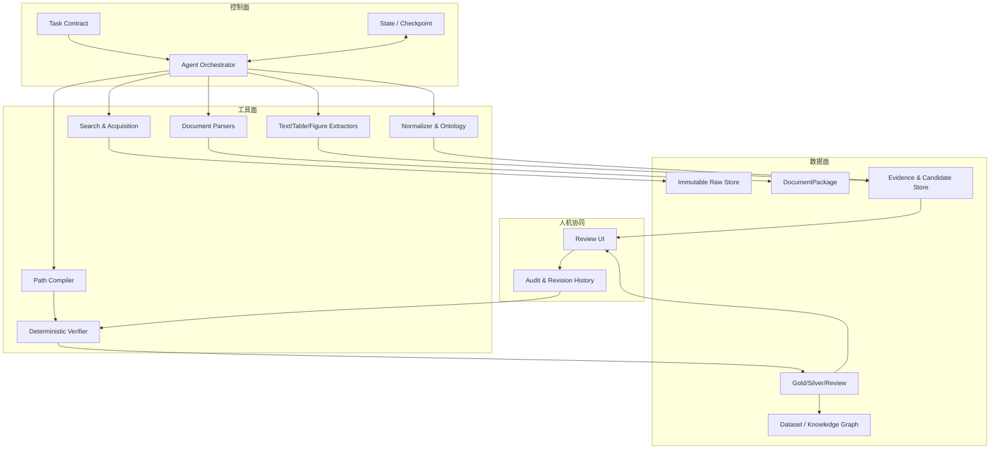

# 调研数据挖掘与处理智能体：领域现状与 ProvSci 功能蓝图

> 版本：2026-08-22｜面向公开仓库与项目汇报｜项目阶段：ProvSci v0.3 工程原型

## 摘要

科学论文中真正可复用的结果，往往分散在正文、表格、图、公式和补充材料里。传统文献检索与问答系统可以帮助研究者“找到并读懂论文”，但距离“稳定生产可直接分析、建库或用于模型训练的科学数据”仍有明显距离：数值可能缺少单位，实验结果可能和错误的样本或条件绑定，图表数据可能只能估读，引用可能只定位到论文而不能定位到具体证据，模型也可能在没有证据时生成看似合理的字段。

本调研将相关技术分为六层：

1. 科学文档解析与版面恢复；
2. 文本、表格、图表和公式的信息抽取；
3. 实体、单位、条件和 schema 标准化；
4. 知识图谱、数据集与证据组织；
5. LLM/VLM 与多智能体任务编排；
6. provenance、验证、人工复核与质量治理。

调研结论是：未来有价值的结果数据智能体，不应只是“更强的论文问答机器人”，而应是一个**可审计的数据生产系统**。它需要把模型视为候选生成器和语义判断器，把文档定位、单位换算、路径执行、质量门禁、许可检查和数据版本管理交给可测试的工具，并允许专家复核高风险难例。

ProvSci 因此选择一条 provenance-native 路线：每条进入 Gold 的结果都必须同时具有细粒度证据、原始值与标准值、可执行 acquisition path、独立重放结果、质量等级和许可状态。

---

## 1. 汇报时先讲清楚的三个概念

### 1.1 什么是“结果数据”

结果数据不是论文摘要，也不是一段自然语言总结。它至少是以下元素的结构化组合：

```text
研究对象 + 指标/关系 + 数值或类别 + 单位 + 实验条件
+ 统计信息 + 证据定位 + 数据来源 + 处理过程 + 质量状态
```

例如，“42 μM”本身不是一个完整结果。只有明确它对应哪个化合物、哪种测量指标、什么实验体系、哪一组样本、哪一个表格单元格、是否为均值以及如何转换单位，它才可能成为可复用数据。

### 1.2 什么是“结果数据智能体”

结果数据智能体是一个能围绕数据生产目标进行规划、调用解析与抽取工具、保存状态、处理失败、验证输出并交付结构化数据的系统。它与固定 pipeline 的关系不是二选一：

- 固定 pipeline 负责稳定、可重复的骨架；
- agent 负责根据文档、模态、任务和失败状态做动态决策；
- LLM/VLM 负责复杂语义、长尾表达和视觉理解；
- 确定性工具负责数值、单位、依赖、路径和硬门禁；
- 人类专家负责高风险、歧义和新领域样本。

### 1.3 什么叫“可审计”

可审计意味着任何一条结果都能回答：

1. 原始文件是什么，版本和 hash 是什么？
2. 证据位于哪一页、哪一段、哪张表、哪一行列或图中哪个区域？
3. 原始字段如何解析、清洗、换算或聚合？
4. 使用了哪些工具、模型、prompt 和版本？
5. 为什么通过或没有通过质量门禁？
6. 清空最终答案后，能否从证据重新执行并得到同一结果？
7. 谁在什么时候人工修改过哪些字段，理由是什么？

---

## 2. 领域范围与调研方法

### 2.1 纳入范围

本调研关注会影响“从科研资料生产结构化结果数据”的技术与系统，包括：

- 科学 PDF、HTML、JATS、Excel 与补充材料解析；
- 文本、表格、图、公式和多模态信息抽取；
- NER、关系/事件抽取、实验条件抽取和实体链接；
- 科学知识图谱、数据集构建和证据综合；
- LLM/VLM 结构化抽取、RAG、深度研究与多智能体系统；
- 数据 provenance、工作流重放、人工复核和质量评测；
- 系统综述中的检索、筛选、数据提取与可视化。

不把通用聊天机器人、纯论文推荐、纯文本摘要或完全不输出结构化数据的工具作为核心对象。

### 2.2 比较维度

对代表性系统建议统一记录以下字段，后续可以直接生成综述图：

| 维度 | 需要记录的内容 |
|---|---|
| 任务 | 检索、筛选、解析、抽取、标准化、综合、验证或建库 |
| 输入 | PDF、JATS、HTML、表格、图、公式、补充材料、数据库 |
| 输出 | 文本答案、JSON、表格、知识图谱、数据集、实验协议 |
| 领域 | 通用、材料、化学、生物医学、地学等 |
| 模型 | 规则、传统 ML、专用模型、LLM、VLM、多智能体 |
| 证据粒度 | 论文、页、段、字符 span、表格单元格、bbox、图中点 |
| 验证 | 无、格式校验、第二模型、规则、重算、专家复核 |
| 评测 | 数据集、样本量、P/R/F1、数值误差、人工时间、成本 |
| 开放性 | 代码、数据、模型、许可证和可复现实验是否开放 |
| 局限 | 版式、模态、领域、成本、稳定性、许可与隐私问题 |

### 2.3 调研边界

不同论文的任务定义、字段集合、文献类型、容差和测试集差异很大，不能把所有 F1 放在一个排行榜中。本文更重视：

- 系统覆盖数据生命周期的哪一段；
- 它提供何种证据和验证；
- 它在哪些条件下有效；
- 哪些能力可以迁移到 ProvSci；
- 哪些结论仍需复现或自建 benchmark 验证。

---

## 3. 领域技术版图



### 3.1 科学文档解析：先恢复“文档是什么”

#### 解决的问题

论文 PDF 不是天然的数据结构。多栏排版、页眉页脚、脚注、公式、跨页表格、扫描页和补充材料会破坏普通文本抽取。文档解析层负责恢复：

- 阅读顺序；
- 标题、摘要、章节和段落；
- 图、表、公式、图注和表注；
- 引用标记与参考文献；
- 页码、字符位置和版面坐标；
- 原始文件与结构化节点之间的映射。

#### 代表路线

- [GROBID](https://github.com/grobidOrg/grobid) 面向学术文档，将 PDF 解析为 TEI XML，擅长元数据、正文结构、引用与版面信息。
- [Docling](https://github.com/docling-project/docling) 提供多格式统一表示，覆盖 PDF 布局、OCR、表格结构、公式与图片等组件。
- [Nougat](https://github.com/facebookresearch/nougat) 使用视觉编码器—解码器处理学术 PDF，尤其关注数学表达与 Markdown/LaTeX 风格输出。
- [Table Transformer](https://github.com/microsoft/table-transformer) 与 PubTables-1M 侧重表格检测和结构识别，为单元格级定位提供基础。

#### 局限

- 解析器恢复的是结构，不等于理解科学语义；
- 不同解析器在扫描件、伪表格、复杂表头和公式上的错误类型不同；
- PDF 中看似正确的阅读顺序仍可能把条件和结果错误关联；
- 解析错误若不保留置信度和原始坐标，会在后续阶段被当成“真实文本”。

#### 对 ProvSci 的启示

采用可插拔 adapter，将不同解析器统一成 `DocumentPackage`，并始终保留原始文件 hash、解析器版本、页码、span、bbox 和解析置信度。解析器不能直接决定结果是否进入 Gold。

### 3.2 文本信息抽取：从句子找到实体、关系和实验事件

#### 典型任务

- 命名实体识别与实体链接；
- 关系、事件与因果表达抽取；
- 数值、范围、误差、显著性和单位抽取；
- 样本、对照、剂量、时间、温度、设备与方法条件抽取；
- 跨句共指与同一实验的字段聚合。

#### 技术演化

1. 规则、词典和正则：稳定、可解释，但跨领域维护成本高；
2. CRF、BiLSTM、BERT 等序列标注：适合定义明确的实体与关系；
3. 领域预训练模型和 ontology：提高专业术语覆盖；
4. LLM 按 schema 抽取：少样本适配快，擅长长尾表达；
5. agentic extraction：先识别实验或结果块，再调用专用工具逐字段处理。

#### 局限

文本抽取最常见的错误不是“完全没抽到”，而是把正确字段绑定到错误实验。例如同一篇论文包含多组样本、多个时间点和多个测量方法，模型可能把 A 实验的条件与 B 实验的数值拼在一起。

#### 对 ProvSci 的启示

候选必须以“结果事件”为中心组织，而不是把整篇论文扁平化成一个字段字典。每个字段都要有独立 evidence locator，并记录字段间为什么属于同一实验。

### 3.3 表格数据抽取：结构恢复只是第一步

#### 完整任务链

```text
表格检测
-> 行列与合并单元格恢复
-> 表头层级解析
-> 单元格 OCR/文本恢复
-> 表注和脚注传播
-> 行实体与列指标绑定
-> 数值、单位和统计量解析
-> 转为规范化长表或领域 schema
```

#### 难点

- 多级表头与跨列标题；
- 单位只出现在表头或表注；
- `±` 可能表示标准差、标准误或其他误差；
- 星号、上标和字母表示显著性或分组；
- 同一单元格中包含范围、多个条件或多个指标；
- 跨页表格和重复表头；
- 表格中的处理条件容易被误当成最终研究结果。

表结构保留对科学信息抽取十分关键。仅把表格 OCR 成一段文本，会丢掉行列语义和字段依赖。

#### 对 ProvSci 的启示

首个强基线应优先做好表格数值结果：它证据边界清晰、结果密度高、可确定性验证，同时包含足够真实的结构和语义难点。

### 3.4 图表与公式抽取：多模态能力的主要增量

#### 图表数据

需要识别：

- 图类型、panel、坐标轴、尺度和单位；
- 图例、颜色、线型、marker 与实验组映射；
- 数据点、曲线、柱、箱线、热图和误差线；
- 图注与正文引用；
- 图像估读误差与置信区间。

[nanoMINER](https://www.nature.com/articles/s41524-025-01674-7) 展示了文本、NER 和视觉智能体协作抽取纳米材料数据的路线，也暴露了上下文混淆等问题。面向材料数据的研究表明，多模态模型可以补充正文中没有明确给出的图形信息，但性能随图形复杂度变化，不能把图像理解等同于精确读数。

#### 公式数据

需要识别变量定义、单位、已知参数、适用条件和公式来源，并把公式转换为安全表达式。模型可以提出公式和变量映射，但执行必须使用白名单算子和显式依赖。

#### 对 ProvSci 的启示

图表结果应保留原图裁剪、bbox、轴变换、图例映射和估读误差；不能伪装成与原始表格同等精度。公式必须经过安全编译与重算。

### 3.5 知识图谱与数据库：从单条结果到跨文献关系

知识图谱适合组织实体、关系、论文、实验、方法和证据之间的连接，也适合跨来源查询和发现冲突。大规模生物医学知识图谱展示了文献抽取与公共数据库融合的价值。

但知识图谱不是天然正确的：

- 一个错误实体链接会污染多条关系；
- schema 过于通用会丢失实验条件；
- schema 过于领域化则难以迁移；
- 只有边而没有证据和生成过程，仍然难以审计。

ProvSci 应先建立结果级证据图：`Document -> Evidence -> Claim -> Transformation -> Verified Result`，再通过领域插件映射到材料、化学或生物医学 ontology。

### 3.6 LLM/VLM 与 Agent：从单次抽取到动态工作流

#### LLM/VLM 的优势

- 可以按自然语言定义新 schema；
- 能处理同义表达和长尾字段；
- 能解释表注、图注和跨段落语义；
- VLM 能处理非标准表格、图和扫描页；
- 可以生成抽取计划、工具参数和初步不确定性说明。

#### LLM/VLM 的风险

- 缺失字段被补全；
- 数值、符号、上下标和单位发生细微变化；
- 输出随 prompt、上下文顺序和模型版本波动；
- “自我反思”不等于独立验证；
- 长上下文会增加成本，也不保证实验级正确绑定；
- 专有模型更新后难以完全复现实验。

#### Agent 真正适用的场景

Agent 的价值不在于给固定 pipeline 换一个名字，而在于动态处理：

- 根据文档类型选择解析器；
- 根据页面质量选择 OCR、VLM 或人工；
- 根据候选类型调用表格、文本、公式或单位工具；
- 根据验证失败原因局部重试；
- 在预算、时间和质量之间选择策略；
- 保存长任务 checkpoint 并支持恢复；
- 将低置信、高风险样本路由给专家。

### 3.7 系统综述与证据综合智能体

系统综述包含问题定义、检索、去重、筛选、数据提取、偏倚评估、统计综合与报告。LLM 已被用于筛选和数据提取，但研究反复说明不同字段、不同领域表现差异明显，人工参考标准仍不可缺少。

截至 2026 年的 agent benchmark 也提示：即使检索阶段有较高 recall，真正按纳排标准识别合格研究仍可能成为瓶颈。因此需要按阶段评测，不能只用一个端到端分数掩盖筛选或抽取错误。

ProvSci 不等同于完整系统综述工具，但可以为其提供最关键的数据提取、证据定位、结果标准化和可视化数据层，并借鉴 [PRISMA 2020](https://www.prisma-statement.org/prisma-2020) 保存检索、筛选与纳排记录。

### 3.8 Provenance、FAIR 与可重复工作流

[FAIR 原则](https://www.nature.com/articles/sdata201618) 强调数据与相关数字对象应可发现、可访问、可互操作、可复用，而且不仅适用于最终数据，也适用于产生数据的算法、工具和工作流。

[W3C PROV-O](https://www.w3.org/TR/prov-o/) 提供 Entity、Activity、Agent 等 provenance 表达基础；[RO-Crate](https://www.researchobject.org/ro-crate/specification.html) 提供研究对象、文件、元数据和工作流的打包方式。

ProvSci 的 `evidence + acquisition_path + verification` 可以先作为轻量实现，后续再映射到 PROV-O 或 Workflow Run RO-Crate，以支持跨系统交换和长期归档。

---

## 4. 代表性路线对比

| 路线/系统 | 核心产物 | 强项 | 对结果数据生产的不足 | ProvSci 中的位置 |
|---|---|---|---|---|
| GROBID | TEI XML | 学术结构、引用、版面信息 | 不负责结果语义和重算 | 可选 PDF adapter |
| Docling | 统一文档表示 | 多格式、布局、OCR、表格、图片 | 解析结果仍需证据与语义验证 | 首选丰富解析 adapter |
| Nougat | Markdown/LaTeX 风格文本 | 数学与扫描学术 PDF | OCR/生成错误可能污染证据 | 数学/扫描 PDF fallback |
| Table Transformer | 表格框与结构 | 单元格结构和 bbox | 不理解实验语义 | 专用表格工具 |
| SciSpaCy 等领域 NLP | 实体与链接 | 术语识别、实体标准化 | 非端到端数据生产 | 可选术语层 |
| 单次 LLM 抽取 | JSON/字段表 | 少样本适配、开发快 | 波动、幻觉、条件错配 | 候选生成 baseline |
| 多模态 LLM | 文本+视觉结构化字段 | 处理图与非标准表 | 精确读数和跨模态对齐仍难 | 图表/难表候选生成 |
| RAG/Paper QA | 带引用回答 | 检索与证据综合 | 回答不等于可入库样本 | 检索与问答接口 |
| 多智能体抽取 | 分工后的结构化数据 | 动态路由、跨模态协同 | 系统复杂，错误可能在 agent 间传播 | 编排层参考 |
| 知识图谱 | 节点与关系 | 跨文献关联与查询 | 错误传播、schema 成本 | 结果与证据组织层 |
| ProvSci | 可验证结果样本 | 证据、路径、重放、质量分层 | 当前仍是小规模工程原型 | provenance-native 数据生产层 |

---

## 5. 现有领域的关键空白

### 5.1 证据定位粒度不足

论文级 DOI 或引用不足以支持数据审计。结果数据需要页码、段落 span、表格行列、bbox、图中 panel/点和补充材料位置。

### 5.2 实验级绑定困难

很多错误来自跨实验混淆，而非字段识别失败。系统必须建模“哪些字段共同描述同一个实验或结果事件”。

### 5.3 数值验证与语义验证割裂

数值可以重算但问题可能不充分；证据句可能相关但单位转换错误。两类验证必须同时存在。

### 5.4 多模态结果缺少统一误差模型

表格原始数值、正文舍入值和图中估读值具有不同精度。系统应保留来源模态和不确定性，不能统一伪装为精确值。

### 5.5 评价集中在字段 F1

字段 F1 无法回答：是否有可靠证据、路径能否重放、是否存在文献泄漏、每篇能产出多少 Gold、人工成本多少、许可是否允许公开。

### 5.6 领域迁移与 schema 治理不足

通用 schema 太浅，领域 schema 太重。需要“稳定核心 schema + 可插拔领域 profile”，并对 schema 版本进行迁移和回归评测。

### 5.7 失败样本被静默丢弃

真实系统必须把 OCR 低置信、单位歧义、证据冲突、许可未知、问题不充分和路径失败作为正式数据产物，而不是只展示成功样本。

### 5.8 开源复现与真实数据许可矛盾

论文代码可以公开，但论文全文、补充材料和衍生数据未必允许再分发。公开项目必须把代码、配置、开放示例、受限数据 manifest 和许可证分开管理。

---

## 6. 我希望实现什么样的结果数据智能体

### 6.1 一句话定义

ProvSci 是一个把科学文献与实验材料转化为**有细粒度证据、有标准字段、有可执行处理路径、能独立验证、可分级入库**的结果数据智能体。

### 6.2 核心设计原则

1. **Evidence first**：没有可定位证据，不生成 Gold。
2. **Raw is immutable**：原始文件、原始值和原始证据不可静默覆盖。
3. **Model proposes, tools verify**：模型提出候选，工具和规则执行硬验证。
4. **Path is data**：处理路径不是日志附件，而是样本的一部分和未来训练信号。
5. **Uncertainty is explicit**：解析、语义、数值和人工判断分开记录。
6. **Failure is a product**：失败原因和人审队列是正式输出。
7. **Document-level isolation**：切分和评测以文献为单位，避免同文献泄漏。
8. **License before release**：许可和敏感信息是入库/公开门禁。
9. **Agent only where needed**：动态决策用 agent，稳定环节保留确定性 pipeline。
10. **Evaluation before scale**：先在人工 Gold 上验证，再追求文献规模。

### 6.3 目标用户

- 从论文和补充材料批量整理实验数据的科研团队；
- 建设领域数据库与知识图谱的数据团队；
- 构建科学问答、数值推理和工具调用训练集的模型团队；
- 审计数据来源、处理过程和许可的数据工程/合规团队；
- 进行系统综述、证据综合和结果可视化的研究者。

### 6.4 完整生命周期



---

## 7. 完整功能蓝图

下面罗列的是目标系统的完整能力，并不代表 v0.3 已全部实现。第 9 节会单独标明当前状态。

### 7.1 任务定义与验收 Contract

- 自然语言描述研究目标；
- 从 JSON Schema、CSV 表头或已有数据库反推字段 schema；
- 定义目标实体、属性、关系、事件与实验条件；
- 定义单位、维度、允许范围、有效数字和容差；
- 定义证据粒度：论文/页/段/span/单元格/bbox/图中点；
- 定义纳入与排除条件；
- 定义可接受来源、时间范围、文献类型与开放许可；
- 定义必须交付的数据集、报告、图和质量指标；
- 将自然语言要求编译为机器可检查的 contract；
- 在运行前检查 contract 是否自洽、字段是否可验证；
- 估算文献规模、模型调用、时间、费用和人工复核量；
- 保存 contract 版本，支持历史任务重跑与差异比较。

### 7.2 文献检索、筛选与获取

- 对接 Crossref、OpenAlex、PubMed、Semantic Scholar 和领域数据库；
- 支持关键词、布尔式、PICO/PIECO、引用网络和相似文献检索；
- 保存完整检索式、数据库、日期、页数和命中数量；
- DOI、PMID、题名、作者和内容 hash 多级去重；
- 识别预印本、会议版、正式版、勘误和撤稿关系；
- 标记开放获取状态、许可证和全文可用性；
- 规则+模型的纳排筛选，并保存理由与证据；
- 支持双人筛选、冲突仲裁和一致性统计；
- 生成 PRISMA 风格流转数据；
- 对目标主题做增量监测和新论文提醒；
- 受限全文只保存本地引用和 hash，不进入公开数据包。

### 7.3 原始材料登记与项目数据管理

- 记录 DOI、URL、题名、作者、年份、来源和下载时间；
- 记录 PDF、HTML、XML、表格、图片和补充材料之间的关系；
- 为每个文件计算 hash，检测重复和静默更新；
- 保存版本、许可证、访问限制和使用目的；
- 识别压缩包内容、命名异常和缺失依赖；
- 建立不可变 raw 区、可重建 intermediate 区和发布区；
- 生成每次运行的 input manifest；
- 支持公开数据与受限数据物理隔离；
- 支持删除请求、撤稿传播和数据失效标记。

### 7.4 多格式与多模态解析

- JSON、CSV、TSV、XLSX、HTML、Markdown、纯文本和 JATS；
- 原生 PDF 文本与布局解析；
- 扫描 PDF 和图片 OCR；
- 标题、摘要、章节、段落、列表和脚注恢复；
- 表格检测、结构识别、跨页拼接和层级表头恢复；
- 图、panel、图注、表注、公式和参考文献识别；
- 版面坐标 bbox、页码、字符 span 和阅读顺序；
- 正文、图表、补充材料和引用关系对齐；
- 语言、编码、希腊字母、上下标和科学计数法规范化；
- 解析器集成、fallback 和 ensemble 比较；
- 每个节点保存解析器版本、置信度与原始定位；
- 支持局部重解析，不必重复处理整篇文献。

### 7.5 结果事件发现与候选挖掘

- 识别 Result、Discussion、Methods、Conclusion 等章节角色；
- 区分研究结果、处理条件、方法参数和背景引用；
- 抽取实体、属性、关系、事件和因果陈述；
- 抽取整数、小数、科学计数法、范围、上下限和近似值；
- 抽取均值、标准差、标准误、置信区间和样本量；
- 抽取比较、趋势、显著性、相关性和方向；
- 抽取样本、对照、剂量、时间、温度、pH、设备和方法；
- 从表格单元格生成结果候选；
- 从图中生成带估读误差的结果候选；
- 从公式和变量定义生成可计算候选；
- 将同一实验的字段聚合为 result event；
- 对重复表述、互补证据和冲突证据聚类；
- 为每个候选保存字段级 evidence locator；
- 支持领域规则、术语表、prompt 和模型插件。

### 7.6 数据清洗、标准化与语义对齐

- 保留 `raw_value`、`parsed_value`、`normalized_value`；
- 单位识别、维度检查、换算和不兼容拦截；
- 温标、浓度、比例、对数尺度和复合单位处理；
- 有效数字、舍入、容差和误差传播；
- 实体同义词、缩写、命名规范和外部 ID 对齐；
- 领域 ontology 或受控词表映射；
- 实验条件结构化和缺失条件标记；
- 表格宽长转换、层级表头展开和脚注传播；
- 缺失值、未报告、不适用、检测下限和零值区分；
- 异常值、重复值、冲突值和不可能值检测；
- 正文、表格、图和补充材料之间的结果对齐；
- 不同文献统计口径和不可比尺度标记；
- 所有变换写入 lineage，禁止无记录的覆盖式清洗。

### 7.7 分类、标注与样本生成

- 学科、子领域和主题分类；
- 结果类型：测量、比较、关系、预测、参数、条件、统计量；
- 任务类型：numeric QA、table lookup、relation、comparison、formula reasoning、open reasoning；
- 模态：文本、表格、图、公式、补充材料、跨模态；
- 难度：步骤数、跨证据、单位转换、图表估读、领域知识要求；
- 许可：公开、内部、未知、不可派生；
- 质量状态和失败模式分类；
- 生成独立可作答的问题，不泄漏答案；
- 保存标准答案、显示答案、单位、容差和条件；
- 生成正例、困难负例、证据不足例、冲突例和拒答例；
- 样本卡、数据卡、批次卡和版本说明；
- 支持字段级人工修订与历史记录。

### 7.8 Provenance 与 Acquisition Path

- 建立 `document -> evidence -> claim -> transform -> answer` 链路；
- 文档、证据、字段、中间值和最终结果都有稳定 ID；
- acquisition path 使用有序步骤；
- 每步声明 action、参数、输入依赖、输出和工具版本；
- 白名单动作包括定位、解析、过滤、单位转换、聚合、比较和安全公式计算；
- 禁止任意代码执行和未声明依赖；
- 保存 LLM/VLM 提议与编译后路径的差异；
- 路径可以局部重试和独立 replay；
- 生成样本级 lineage 图；
- 映射 W3C PROV-O / RO-Crate 的扩展接口；
- 将验证通过的 path 作为未来工具推理训练信号。

### 7.9 验证、质量门禁与不确定性

- JSON/schema 完整性验证；
- evidence 存在性、定位合法性和内容 hash 检查；
- 路径 action 白名单、参数和依赖验证；
- 清空答案后独立 replay；
- 数值绝对/相对容差比较；
- 单位维度与换算结果验证；
- 关系、比较和公式的专用验证；
- 问题是否充分、答案是否唯一的语义门禁；
- 条件是否绑定到正确实验；
- 正文—表格—图—补充材料一致性检查；
- 双解析器或双模型交叉检查；
- 解析置信度、模型置信度、规则结果和人工结论分开记录；
- 校准置信度与真实错误率；
- Gold、Silver、Human Review、Rejected 分层；
- 输出失败字段、失败原因和建议修复动作；
- 防止模型直接写入 `verification.status=pass`。

### 7.10 人工复核与持续改进

- 按风险、信息增益和预计修复成本排序；
- 原文、图表、结构化字段、路径和验证结果并排展示；
- 接受、修改、拒绝、请求重解析或标记许可；
- 支持字段级差异和审核理由；
- 双人审核、仲裁和 inter-annotator agreement；
- 将专家修订转化为规则测试、prompt 示例或训练数据；
- 模型/解析器更新后自动回归评测；
- 主动学习选择最有价值的待标注样本；
- 监控某类错误是否反复出现并形成修复建议；
- 保留所有历史版本，避免覆盖专家结论。

### 7.11 数据集、数据库与知识图谱管理

- Gold/Silver/Review/Rejected 独立存储；
- 数据集版本、冻结、差异、合并和回滚；
- 文献级 train/dev/test 隔离；
- 引用网络、近邻问题和多版本文献泄漏检测；
- 近重复样本、同证据多问和模板化问题检测；
- JSONL、CSV、Parquet、RDF/图数据库导出；
- 领域 schema profile 与迁移工具；
- DOI、ORCID、ROR、领域数据库 ID 对齐；
- 文献、实验、结果、证据和路径的图查询；
- 撤稿、勘误和上游数据变化的影响传播；
- 生成 FAIR 数据说明与机器可读 metadata；
- 支持 RO-Crate 研究对象打包。

### 7.12 分析、综述绘图与科研交付

- 文献数量、筛选、纳排和数据产出统计；
- 领域、年份、模态、实体、指标和单位分布；
- 结果趋势、条件分层、相关关系和冲突来源；
- 系统能力矩阵、技术演化时间线和证据网络；
- 性能—成本—可审计性 Pareto 图；
- 适用时生成森林图、效应图和异质性分析；
- 图中每个点回链到样本、证据和原文；
- 同时导出图、CSV/JSON、绘图配置和脚本；
- 生成研究报告、方法附录、数据字典和质量报告；
- 生成 PRISMA 风格流程图与纳排清单；
- 支持交互过滤、对比和异常点下钻；
- 结果更新后自动重绘并生成差异报告。

### 7.13 查询、接口与 Agent 交互

- CLI 单文档、批处理和 benchmark；
- Python API 与 REST API；
- 自然语言查询已验证结果；
- 回答必须返回证据和完整样本，不只返回一句文本；
- 支持按实体、指标、条件、单位、年份和质量级别过滤；
- 支持“为什么这个结果进入 Gold/Review”的解释；
- 支持“从这个证据重新计算”的显式命令；
- 支持长任务 pause/resume/checkpoint；
- 任务队列、并发、重试和幂等；
- 工作流事件与外部标注/数据库系统集成；
- 工具调用预算、超时和 fallback；
- 模型不可用时保留确定性 baseline。

### 7.14 安全、许可、隐私与运维

- 密钥、token、账号和受限全文不写入仓库；
- prompt injection 与文档内恶意指令隔离；
- 工具白名单、最小权限和运行沙箱；
- schema 校验、输入限制和安全表达式求值；
- 个人信息、患者数据和敏感字段识别；
- 许可证、使用目的和公开范围门禁；
- 日志脱敏、访问控制和项目隔离；
- 监控吞吐、延迟、费用、失败和重试；
- 监控字段分布、解析质量和模型漂移；
- 发布前 secret scan、license scan 和数据清单；
- 本地、私有云和离线部署；
- 依赖锁定、SBOM、漏洞与供应链检查；
- 灾难恢复、备份和可重复构建。

---

## 8. 推荐系统架构



### 为什么不采用单体大模型

- 难以定位错误发生在解析、抽取、标准化还是综合；
- 模型更新会改变整个系统行为；
- 数值和单位不适合只靠语言概率判断；
- 无法对不同阶段分别建立 benchmark；
- 失败后往往只能整篇重跑，成本高且不可控。

分层架构允许每层使用最合适的模型或工具，也允许在没有模型密钥时运行可复现 baseline。

---

## 9. ProvSci v0.3 当前实现与目标差距

| 模块 | v0.3 当前状态 | 下一步 |
|---|---|---|
| 输入 | JSON/CSV/TSV/HTML/Markdown/文本/XLSX/JATS，PDF 文本基线 | Docling/GROBID，扫描 PDF 与 bbox |
| 候选 | 表格数值、正文测量、均值±误差、关系三元组 | 图表、公式、跨证据 result event |
| 路由 | section-aware、result-focused | 学习式路由与跨领域配置 |
| 标准化 | 数值、部分单位和换算 | ontology、复杂单位、误差传播 |
| 样本 | task/evidence/path 结构 | 领域 profile、更多任务类型 |
| Path | 白名单动作、依赖检查、可重放 | path compiler、PROV-O/RO-Crate 映射 |
| 验证 | 数值、单位、关系、路径与语义门禁 | 多模态验证、置信度校准、双系统检查 |
| 分层 | Gold/Silver/Human Review | 完整审核 UI 与主动学习 |
| 批处理 | manifest、文献级切分、JSONL | 数据集版本、数据库和增量运行 |
| 查询 | 已验证结果的透明词法查询 | 带过滤、解释与证据下钻的 API/UI |
| 评测 | 本地 fixture、真实开放 JATS、策略对比 | 多领域人工 Gold、外部 baseline 复现 |
| 部署 | 标准库 CLI 原型 | 服务化、任务队列、权限与监控 |

当前定位应明确表述为：**可审计结果数据智能体的工程原型与确定性 baseline**，而不是已经完成的通用科学家智能体。

---

## 10. 最小可验证产品与研究问题

### 10.1 推荐首个通用结果切片

第一阶段不把产品锁死在某个材料或生物医学领域，先选择开放文献充足、结果密集、单位体系清晰、专家可核验的通用结果形态，聚焦：

> 表格或结果段中的带单位数值 + 实体/指标/实验条件 + 细粒度证据 + 单位标准化 + path replay。

具体领域（例如生物医学细胞活性）通过 profile 提供术语表和专用验证器，不改变通用 ResultCard、provenance、许可和 replay 门禁。

### 10.2 MVP 闭环

1. 冻结 50–100 篇开放文献；
2. 专家定义 schema 和标注指南；
3. 建立文献级 Gold benchmark；
4. 比较规则、单次 LLM、丰富解析器和 agentic workflow；
5. 输出 Gold、Silver 和 Review；
6. 每条 Gold 独立 replay；
7. 报告精度、召回、路径复现率、产出率、成本和人工时间；
8. 公布失败案例和可复现运行说明。

### 10.3 可以形成论文的问题

- 可执行 provenance 是否能显著降低 fabrication rate？
- result-focused 路由是否能提高有效候选 precision 而不牺牲 recall？
- 表格结构、正文上下文和领域 ontology 各自贡献多少？
- LLM 提议路径 + 确定性编译是否优于直接结构化输出？
- 如何校准图表估读和跨模态对齐的不确定性？
- 人工复核如何按信息增益排序，降低 cost per Gold？
- path-supervised 数据是否能提升后续科学工具推理？

---

## 11. 评价体系

### 11.1 文档层

- 解析成功率；
- 阅读顺序正确率；
- 章节、表格、图和公式恢复率；
- 单元格结构与 bbox 准确度；
- OCR 字符错误率；
- 文档处理耗时与失败恢复率。

### 11.2 候选与字段层

- candidate recall；
- 字段 precision/recall/F1；
- 数值绝对/相对误差；
- 单位准确率与维度兼容率；
- 条件完整率与实验绑定准确率；
- 缺失字段的正确 abstention。

### 11.3 证据与路径层

- Evidence Precision/Recall；
- 定位粒度与定位准确率；
- Path Validity；
- Path Reproducibility；
- replay 与标准答案一致率；
- 未声明依赖和非法动作拦截率。

### 11.4 样本与数据集层

- 问题独立可答率；
- 语义正确率；
- Gold Yield；
- fabrication rate；
- 重复率与近邻率；
- 文献/引用网络泄漏率；
- 领域、模态和许可证覆盖。

### 11.5 系统与人机协同层

- 每篇文献处理时间；
- 每个有效 Gold 的 API/计算成本；
- 人工复核分钟数；
- 自动接受、复核、拒绝比例；
- 复核者一致性；
- 失败重试成功率；
- 模型更新前后的质量回归。

### 11.6 报告要求

所有指标必须同时给出：

- 总体值和按文献、领域、模态、字段分组值；
- 样本量、置信区间或方差；
- 任务、数据集、容差和纳排定义；
- 失败案例与误差来源；
- 模型、解析器、prompt、代码和运行日期；
- 不可直接横向比较的限制。

---

## 12. 综述绘图方案

综述图应全部来自同一份 `literature_matrix`，而不是手工复制论文数字。

| 图 | 回答的问题 | 推荐形式 |
|---|---|---|
| 技术演化 | 规则、专用模型、LLM/VLM、Agent 如何演化？ | 分层时间线 |
| 方法分类 | 每个系统覆盖完整链路的哪一段？ | taxonomy/泳道图 |
| 能力矩阵 | 哪些系统支持文本、表、图、证据和验证？ | 注释热力图 |
| 证据链 | 原文如何变成最终数据？ | 流程图/Sankey |
| 性能—成本—审计 | 准确率与成本、审计性如何权衡？ | 气泡/Pareto 图 |
| 模态与领域分布 | 研究集中在哪些领域和模态？ | 堆叠柱状图 |
| 指标覆盖 | 现有评测忽略了哪些维度？ | UpSet/热力图 |
| 失败模式 | 主要错误来自哪里？ | Pareto 柱状图 |
| 项目定位 | ProvSci 相比代表系统补了哪一层？ | 对比矩阵 |

绘图必须保留数据、脚本、配置、来源 ID、检索截止日期和缺失值说明；对不具可比性的指标不做简单排名。

---

## 13. 分阶段路线图

### P0：可信表格结果闭环

- 冻结真实开放 benchmark；
- 完成人工 Gold 与标注指南；
- 强化层级表头、脚注、条件和单位；
- 保证每条 Gold 都能 replay；
- 建立 human review 队列；
- 自动生成综述矩阵和核心图；
- 与规则和单次 LLM baseline 对比。

### P1：复杂 PDF 与多模态

- 接入 Docling/GROBID/Table Transformer；
- 保存 bbox 和解析器置信度；
- 图表筛选、轴/图例解析和 VLM 读图；
- 公式识别、安全编译与计算；
- 正文—表—图—补充材料对齐；
- 多模态不确定性和冲突检测。

### P2：领域化与人机协同

- 选择首个领域 profile；
- 接 ontology、术语表和外部 ID；
- 建设审核 UI、双人复核与主动学习；
- 数据集版本、回滚和影响分析；
- 形成 publication-grade benchmark。

### P3：规模化数据生产

- 检索、增量监测和批量任务队列；
- 数据库、知识图谱和 API；
- 成本—质量动态路由；
- 本地/私有部署、权限与审计；
- FAIR/RO-Crate 导出；
- 持续质量、漂移和安全监控。

---

## 14. 公开仓库应该如何讲

建议按下面顺序直接打开仓库汇报：

1. README 开头：一句话定位与四个可审计问题；
2. 本文第 3 节：领域技术版图；
3. 本文第 5 节：现有方案空白；
4. 本文第 6 节：ProvSci 定义与设计原则；
5. 本文第 7 节：完整功能蓝图；
6. 本文第 9 节：已实现和计划能力边界；
7. `src/provsci/`：展示 pipeline、path 和 verifier；
8. `tests/` 与 benchmark 文档：说明可复现证据；
9. 本文第 10、11、13 节：MVP、评价与路线图。

汇报时最重要的一句话是：

> ProvSci 的创新目标不是让模型再生成一份更像真的答案，而是把每条科学结果变成可以回到原文、检查处理步骤并重新计算的数据资产。

---

## 15. 当前限制与公开声明

- v0.3 是小规模原型，现有 benchmark 不能代表所有学科或复杂 PDF；
- 当前主要覆盖文本和表格数值，图表与公式仍是计划能力；
- 现有结果不能直接宣称优于所有外部系统；
- 真实论文示例必须逐项核对开放许可；
- 公开仓库不应包含私有全文、账号信息、token、内部业务材料或个人聊天记录；
- 所有未来性能结论都应来自冻结数据集、明确标注协议和可重现实验。

---

## 16. 参考资料

### 文档解析与表格

1. [GROBID：科学文档解析与 TEI 结构化](https://github.com/grobidOrg/grobid)
2. [Docling：多格式文档理解与统一表示](https://github.com/docling-project/docling)
3. [Docling Technical Report](https://arxiv.org/abs/2408.09869)
4. [Nougat：Neural Optical Understanding for Academic Documents](https://arxiv.org/abs/2308.13418)
5. [Table Transformer / PubTables-1M](https://arxiv.org/abs/2110.00061)

### 科学信息抽取与多模态

6. [Extracting accurate materials data with conversational language models](https://www.nature.com/articles/s41467-024-45914-8)
7. [Agent-based multimodal information extraction for nanomaterials](https://www.nature.com/articles/s41524-025-01674-7)
8. [Extracting Polymer Nanocomposite Samples from Full-Length Documents](https://arxiv.org/abs/2403.00260)
9. [A comprehensive large-scale biomedical knowledge graph](https://www.nature.com/articles/s42256-025-01014-w)
10. [Verification and execution of scientific literature via chemputation and LLMs](https://www.nature.com/articles/s42004-026-01993-w)

### 系统综述与证据综合

11. [Exploring LLM data extraction in systematic reviews](https://arxiv.org/abs/2405.14445)
12. [TrialMind：Accelerating Clinical Evidence Synthesis with LLMs](https://arxiv.org/abs/2406.17755)
13. [PRISMA 2020](https://www.prisma-statement.org/prisma-2020)

### 数据、Provenance 与可复现性

14. [The FAIR Guiding Principles](https://www.nature.com/articles/sdata201618)
15. [W3C PROV-O](https://www.w3.org/TR/prov-o/)
16. [RO-Crate Specification](https://www.researchobject.org/ro-crate/specification.html)
17. [FAIR and Interactive Data Graphics from a Scientific Knowledge Graph](https://www.nature.com/articles/s41597-022-01352-z)

> 本资料表截至 2026-08-22。新系统和新论文应进入统一的文献矩阵后再更新结论；单个项目的宣传描述不视为独立性能证据。
